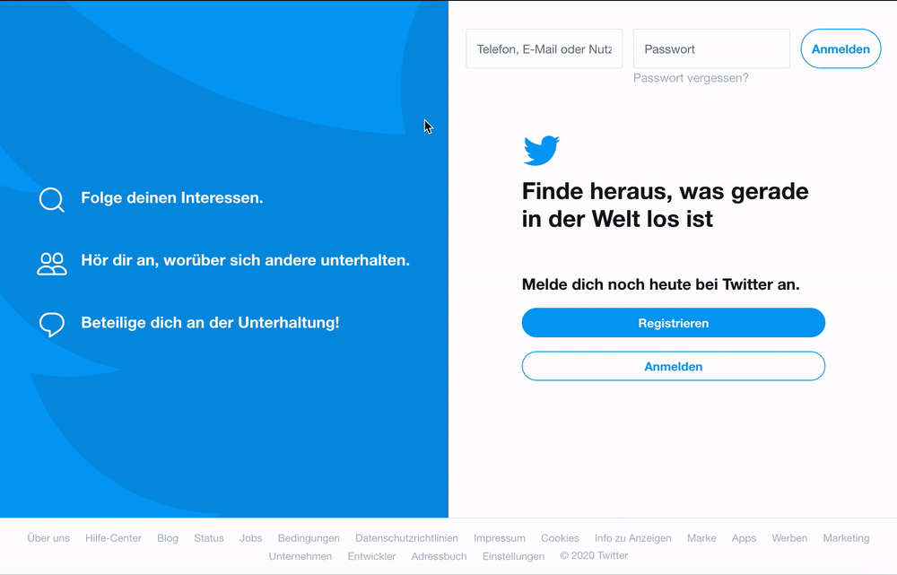

# sysPass Firefox integration

Integrates sysPass password manager in Firefox

Addon page: https://addons.mozilla.org/de/firefox/addon/syspass/

Works with Firefox, Chrome and Edge Chromium



## Configuration

In sysPass go to `User and Accesses -> Api Authorizations` and add permissions for

* "Search for Accounts"
* "View password"

:warning: Both have to have the same password

In Firefox go to the Addons page (cmd+shift+A / `about:addons`) and edit sysPass Addon settings. Add URL (https required), API token and API password. 

## Development

Clone repository:

```
git clone git@github.com:ochorocho/syspass-firefox.git
cd syspass-firefox
yarn install
```

To use [web-ext](https://www.npmjs.com/package/web-ext) to run an instance of Firefox with the addon enabled run the following within the pugins directory:

```
yarn dev
```

Package addon:

```
yarn build
```
